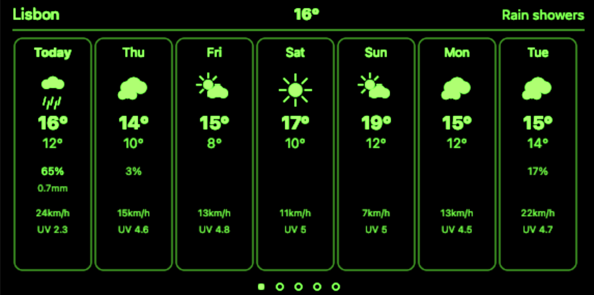
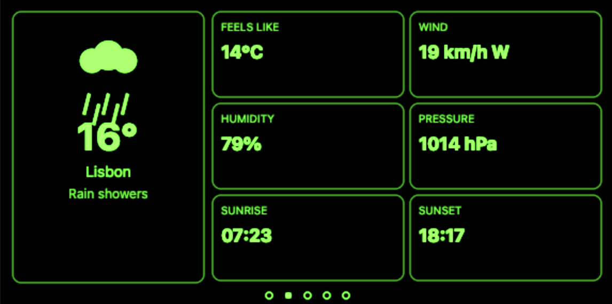
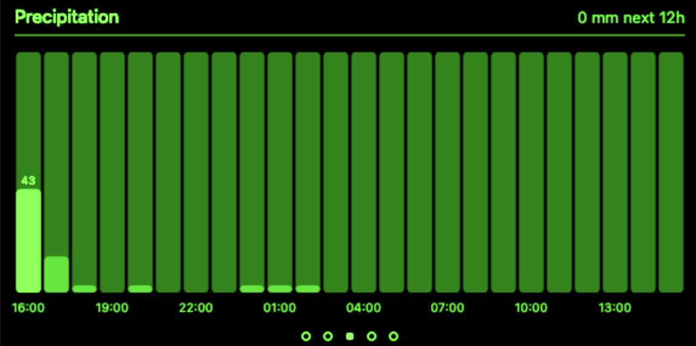
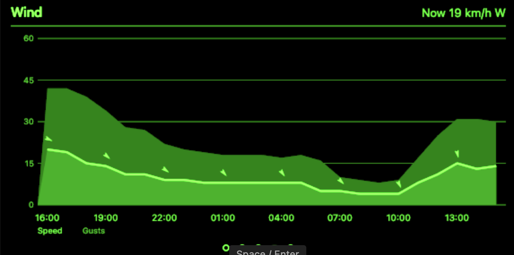
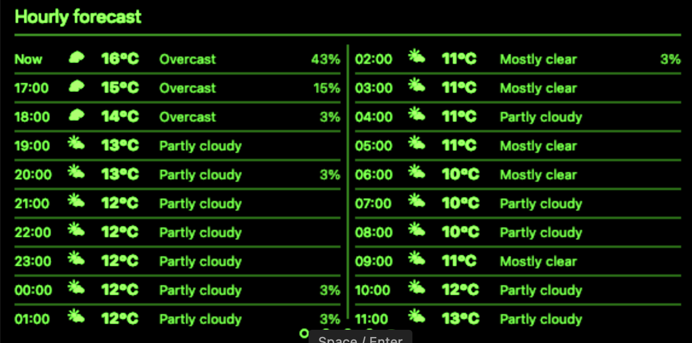

# Weather Even G2

> See also: [G2 development notes](https://github.com/nickustinov/even-g2-notes/blob/main/G2.md) – hardware specs, UI system, input handling and practical patterns for Even Realities G2.

Weather forecast for [Even Realities G2](https://www.evenrealities.com/) smart glasses.

Five full-screen Canvas-rendered pages – 7-day forecast, current conditions, precipitation chart, wind chart and 20-hour hourly forecast – all driven by the free [Open-Meteo](https://open-meteo.com/) API with no API key required.

<p>
  
  
</p>
<p>
  
  
</p>
<p>
  
</p>

## System architecture

```
[G2 glasses] <--BLE--> [Even app / simulator] <--HTTP--> [Open-Meteo API]
```

No backend server needed. The browser calls Open-Meteo directly (free, CORS-enabled).

## App architecture

```
g2/
  index.ts         App module registration
  main.ts          Bridge connection + settings UI bootstrap
  app.ts           Thin orchestrator: initApp, refreshWeather
  state.ts         WeatherData types, app state singleton, bridge holder
  api.ts           Open-Meteo geocoding + forecast API client
  renderer.ts      All screen rendering (5 Canvas-drawn pages)
  events.ts        Event normalisation + screen dispatch
  icons.ts         Canvas-based weather icon renderer (7 icon types)
  layout.ts        Display dimension constants
  ui.tsx           React settings panel (city search, connection)

_shared/
  app-types.ts     AppModule/AppActions contract
  log.ts           Event log utility
```

### Data flow

`app.ts` is the entry point. On startup it fetches weather via `api.ts`, stores it in the `state.ts` singleton, and tells `renderer.ts` to paint the current screen as a full-screen Canvas image pushed to the glasses. User interactions flow through `events.ts`, which normalises raw SDK events and dispatches tap/swipe to cycle between screens. Weather auto-refreshes every 15 minutes.

### Screens

1. **7-day forecast** – horizontal day columns with weather icons, high/low temperatures, precipitation probability, wind speed and UV index
2. **Current conditions** – left panel with large weather icon, temperature, city and description; right panel with 2×3 detail cards (feels like, wind, humidity, pressure, sunrise, sunset)
3. **Precipitation** – vertical bar chart of hourly precipitation probability over 24 hours
4. **Wind** – area chart of wind speed and gusts over 24 hours with directional arrows
5. **Hourly forecast** – two-column list showing 20 hours with icons, temperatures, conditions and precipitation

### Navigation

| Input | Action |
|---|---|
| Tap | Next screen |
| Swipe down | Next screen |
| Swipe up | Previous screen |
| Double tap | Refresh weather + go to first screen |

## Setup

### Run with even-dev

Requires [even-dev](https://github.com/BxNxM/even-dev) (Unified Even Hub Simulator v0.0.2).

```bash
npm install

# Symlink into even-dev (adjust paths to your local setup)
ln -s /path/to/weather-even-g2/g2 /path/to/even-dev/apps/weather

# Run
cd /path/to/even-dev
APP_NAME=weather ./start-even.sh
```

Search for a city in the browser settings panel, then click **Connect** to load the forecast on the glasses display.

## Tech stack

- **Weather API:** [Open-Meteo](https://open-meteo.com/) (free, no API key)
- **G2 frontend:** TypeScript + [Even Hub SDK](https://www.npmjs.com/package/@evenrealities/even_hub_sdk)
- **Settings UI:** React + [@jappyjan/even-realities-ui](https://www.npmjs.com/package/@jappyjan/even-realities-ui)
- **Build:** [Vite](https://vitejs.dev/) + [Tailwind CSS](https://tailwindcss.com/)
